# SwitchHZ Help

This app requires below two permisssion to work properly.

 * Write secure settings (Required to write refresh rate value). 
 * Disablement of Battery Optimisation for this app(Needed for Battery mode).
 
---
---

## Write secure settings(Requires PC)

### 1. Enable developer mode

 * Go to **Settings** >>> **About phone** and then tap **Build number** multiple times. This will enable Developer mode in Settings.


### 2. Enable USB debugging

 * Go to **Settings** >>> **System** >>> **Developer options**, scroll down and enable **USB debugging** option.


### 3. Download ADB on your PC

 * Download ADB for your pc from [here](https://www.xda-developers.com/google-releases-separate-adb-and-fastboot-binary-downloads).

 * Unzip the downloaded zip.
 ---

### 4. Granting Permission

#### 4.1. Connect your phone to your PC.

#### 4.2. Navigate to the path where you have unzipped ADB.

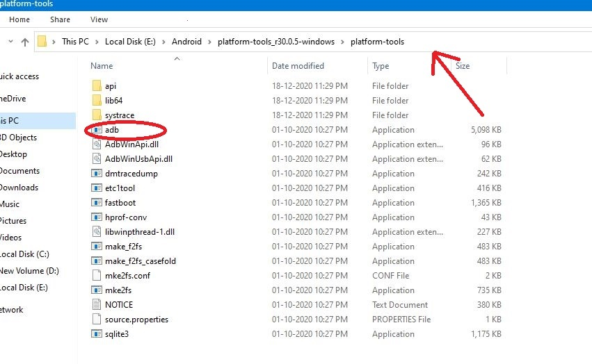

#### 4.3. Open cmd in that path location.

 * This can be done by typing **cmd** in Address Bar and then hit enter.
 
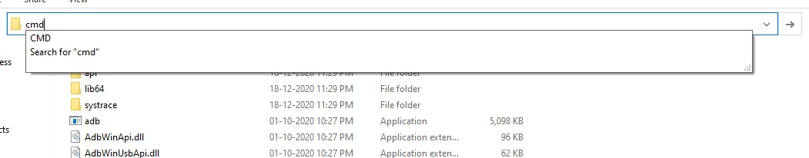
**CMD**
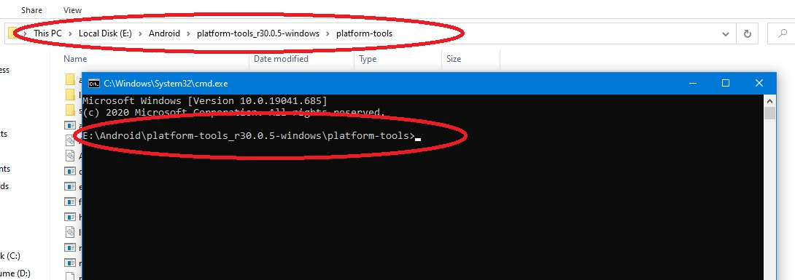

#### 4.4. Allow your computer to be used for USB debugging.

 * Enter ```adb kill-server``` in cmd and hit enter. This will kill if any adb connention is live.

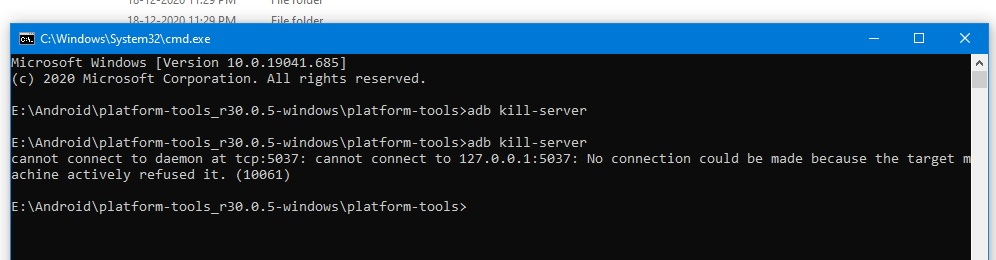

 * Now Enter ```adb start-server``` in cmd and hit enter. This will create a new adb connection to available device.
 
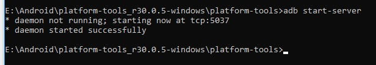

* Now look for a prompt **Allow USB debugging** in your device and click **Ok/Allow**.

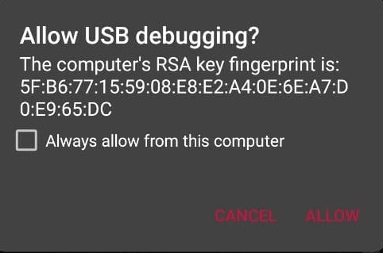

* If above steps are follwed correctly then your decice will be listed with command ```adb devices``` just like in below picture.

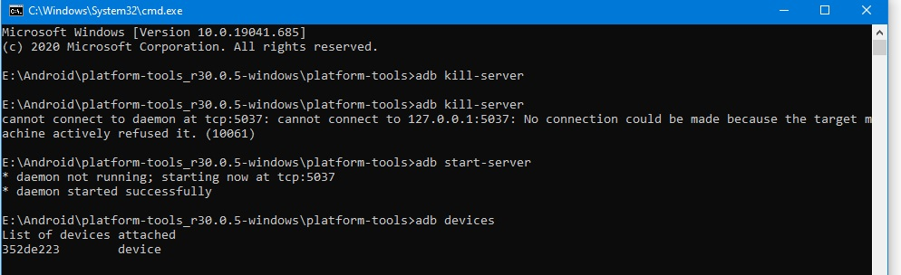

#### 4.5. Granting write secure settings permission to the app.

 * Enter the below command in CMD, followed by an enter:

 ```adb shell pm grant com.mpschahal16.switchhz android.permission.WRITE_SECURE_SETTINGS```
 
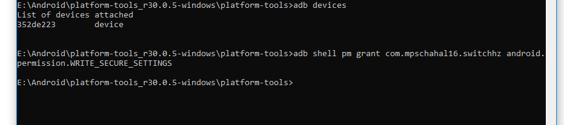

#### 4.6. Disable USB debugging.
 
  * Go to **Settings** >>> **System** >>> **Developer options**, scroll down and disable **USB debugging** option.
  
### 5. Done With Part 1.

 * We are done with providing Write secure settings to the app. 
 
 ---
 ---

## Disablement of Battery Optimisation

  * Go to **Settings** >>> **Battery** >>> **Battery optimisation**, and search for **SwitchHZ**.
  
  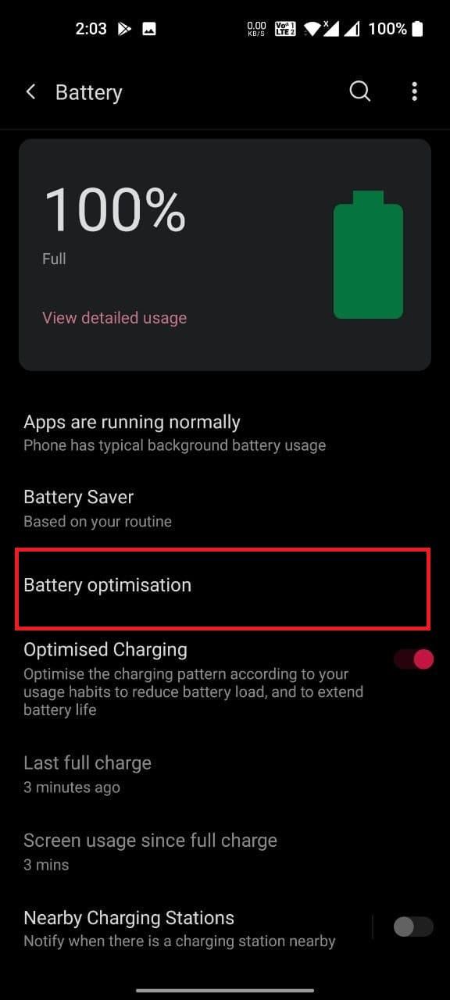
  
  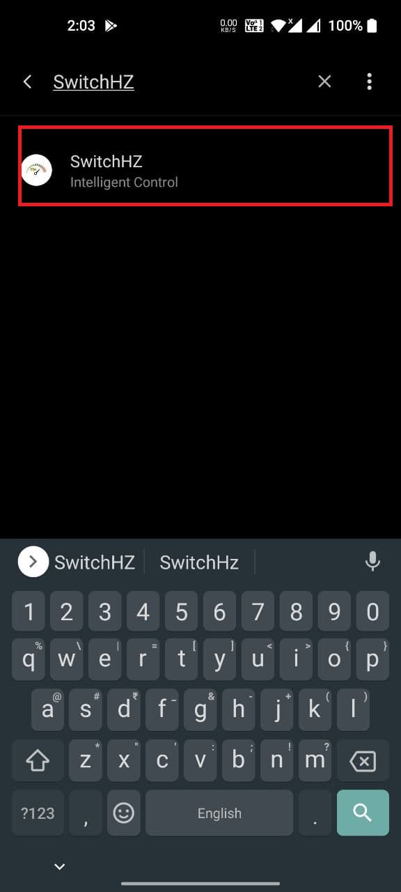
  
  * Click on **SwitchHZ** and then select **Don't optimise**.
  
  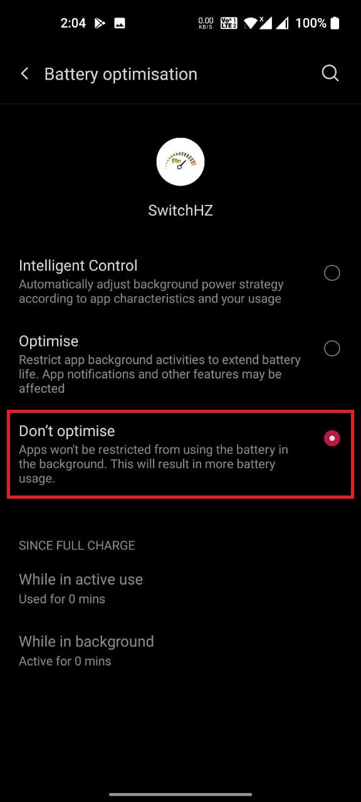
  
# Done!! Never Settle ;)
